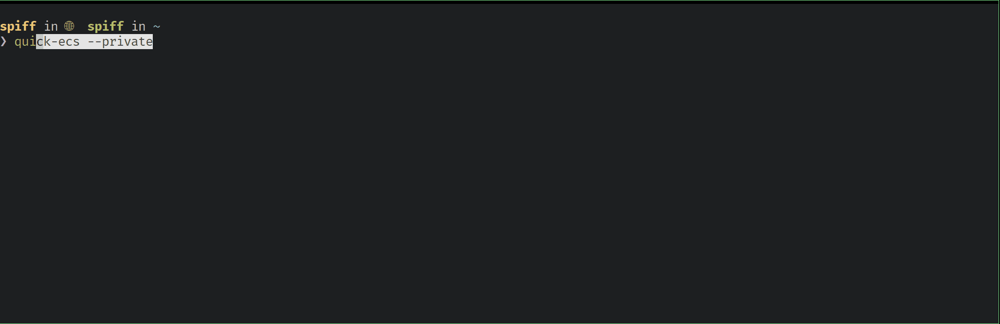

# Quick ECS

A simple Go CLI for quickly inspecting and managing Amazon ECS services. 
It helps you list clusters and services, inspect configs, review health checks, 
stream logs, exec into containers, adjust capacity, and more — with fast, 
readable output designed for day-to-day operations and troubleshooting.

Part of the `Quick Tools` family of tools from [Bevel Work](https://bevel.work/quick-tools).

Streaming Logs from an ECS service:


Pulling an aggregated list of security groups for your service and related ALBS:


Check common misconfigurations and health checks:



## ✨ All Features

- Simple navigation for `ecs exec`. (Get a shell to a container via ECS Exec)
- Quickly get status of all ECS clusters and services
- Pull task and service configurations and compare with the latest deployment
- Set service capacity, and force new deployments
- Update service image versions
- Security groups view
  - Shows ALB and Task security groups
  - Aggregates inbound/outbound rules across SGs
  - Compact rule owners list with colored direction tags [In]/[Out]
  - Prints SG names alongside IDs
- Health checks view
  - Task definition container health checks (command, intervals/timeouts, estimated time to unhealthy)
  - ALB Target Group health checks (protocol, path/port, thresholds, matcher)

## Demo (examples)

```bash
quick-ecs # Default 
quick-ecs --region us-east-1 # Overried profile region

AWS_PROFILE=my-profile quick-ecs
aws-vault exec my-profile -- quick-ecs
granted --profile my-profile quick-ecs
```

## Install

### Required Software
- Go 1.24.4 or later
- AWS CLI v2 (required for ECS Exec integration)

### Build from Brew
```bash
brew tap bevelwork/tap
brew install quick-ecs
quick-ecs --version
```

### Install with Go
```bash
go install github.com/bevelwork/quick_ecs@latest
quick-ecs --version
```

## Notes on Select Actions

### Exec (ECS Exec)
The tool invokes `aws ecs execute-command` and will offer to enable ECS Exec on the service if it’s disabled. If it fails, check AWS docs:
- Setup and considerations: https://docs.aws.amazon.com/AmazonECS/latest/developerguide/ecs-exec.html
- Troubleshooting: https://docs.aws.amazon.com/AmazonECS/latest/developerguide/troubleshooting.html

### Logs
- Logs: Stream service-wide logs (all running tasks)
- Task logs: Stream logs for a specific running task. You'll see each task's task definition version and how long it has been running to help choose newest/oldest.

### Health Checks
- Task checks run inside the container (command-based).
- ALB checks probe over the network, so SGs, NACLs, routing and target port exposure matter.
- Estimated time to unhealthy is printed for both (typical and worst-case).

### Security Groups
- Lists ALB and Task SGs one per line with names.
- Aggregates inbound/outbound rules across all SGs and shows a compact owners list per rule.

## Troubleshooting

- Authentication
  - If startup fails with authentication errors, confirm credentials and region.
  - `aws sts get-caller-identity` should work with your environment.

- ECS Exec (exec action)
  - Ensure ECS Exec is enabled on the service and you meet IAM requirements.
  - Use the docs linked above for setup and troubleshooting.

- Logs
  - Ensure the task definition has an `awslogs` configuration and group.

- Permissions
  - Your credentials need capabilities to call ECS/EC2/ELB/IAM/CloudWatch Logs APIs used by the tool.

## Version

The binary supports `--version` and prints either an ldflags-injected build version or a fallback development version.

## License

Apache 2.0
